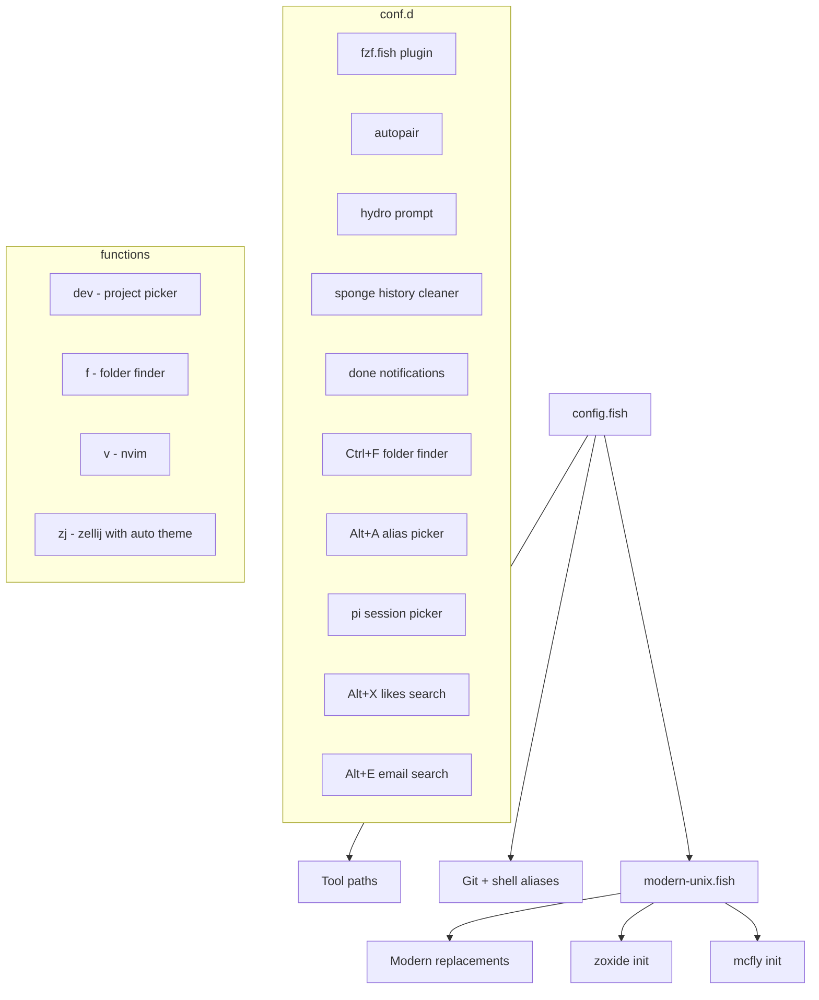

# fish-config

My fish shell config for macOS. Opinionated, minimal, built around fzf and modern Unix replacements.

## How it works



## Key bindings

| Binding | Action |
|---------|--------|
| `Ctrl+F` | Fuzzy-find any folder under `~` and cd into it |
| `Ctrl+R` | Search shell history (mcfly + fzf) |
| `Alt+A` | Fuzzy-pick an alias to run |
| `Alt+X` | Search X/Twitter likes |
| `Alt+E` | Search email archive |
| `Alt+Ctrl+F` | fzf directory search (current dir) |
| `Alt+Ctrl+L` | fzf git log |
| `Alt+Ctrl+S` | fzf git status |
| `Alt+Ctrl+P` | fzf processes |
| `Ctrl+V` | fzf variables |

## Custom functions

| Command | What it does |
|---------|-------------|
| `f` | Fuzzy-find and cd into any folder under `~` (also bound to Ctrl+F) |
| `dev` | Fuzzy-find `~/Developer` projects. Enter opens pi, Ctrl+P just cd's |
| `v` | nvim |
| `vf` | Edit this config in nvim |
| `zj` | Launch Zellij, auto-matching light/dark system theme |
| `brd` | `bun run dev` |

## Modern Unix replacements

Standard tools replaced with better alternatives. Sourced from `modern-unix.fish`.

| Original | Replacement | Notes |
|----------|------------|-------|
| `cat` | [bat](https://github.com/sharkdp/bat) | Syntax highlighting, no paging |
| `ls` | [eza](https://github.com/eza-community/eza) | Icons, git status, grouped dirs |
| `tree` | [eza --tree](https://github.com/eza-community/eza) | 2-level tree with icons |
| `du` | [dust](https://github.com/bootandy/dust) | Visual disk usage |
| `df` | [duf](https://github.com/muesli/duf) | Pretty disk free |
| `cd` | [zoxide](https://github.com/ajeetdsouza/zoxide) | Frecency-based autojump |
| `Ctrl+R` | [mcfly](https://github.com/cantrill/mcfly) | Neural network history search |
| `find` | [fd](https://github.com/sharkdp/fd) | Used by `f` function under the hood |
| `grep` | [ripgrep](https://github.com/BurntSushi/ripgrep) | Available as `rg` |
| `px` | [procs](https://github.com/dalance/procs) | Modern process viewer (not aliased to `ps`) |

## Fish plugins

Managed with [fisher](https://github.com/jorgebucaran/fisher):

- **[hydro](https://github.com/jorgebucaran/hydro)** - minimal prompt
- **[fzf.fish](https://github.com/PatrickF1/fzf.fish)** - fzf integration for files, git, history, processes, variables
- **[autopair](https://github.com/jorgebucaran/autopair.fish)** - auto-close brackets and quotes
- **[done](https://github.com/franciscolourenco/done)** - notification when long-running commands finish
- **[sponge](https://github.com/meaningful-ooo/sponge)** - clean failed commands from history

## Git aliases

```
gl   git log --oneline
gs   git status
gp   git push
gpl  git pull
gc   git checkout
gcb  git checkout -b
gcm  git commit -m
gaa  git add .
gcl  git clone
gfp  git fetch --prune
grv  git remote -v
```

## Secrets

Credentials live in `conf.d/secrets.fish` which is gitignored. The `fish_variables` file (universal vars) is also gitignored since it can contain persisted secrets.

## Setup on a new machine

```fish
# Back up existing config
mv ~/.config/fish ~/.config/fish.bak

# Clone
git clone git@github.com:sasha-computer/fish-config.git ~/.config/fish

# Install fisher + plugins
curl -sL https://raw.githubusercontent.com/jorgebucaran/fisher/main/functions/fisher.fish | source
fisher update

# Create secrets file
echo 'set -Ux OP_SERVICE_ACCOUNT_TOKEN "your-token-here"' > ~/.config/fish/conf.d/secrets.fish
```
